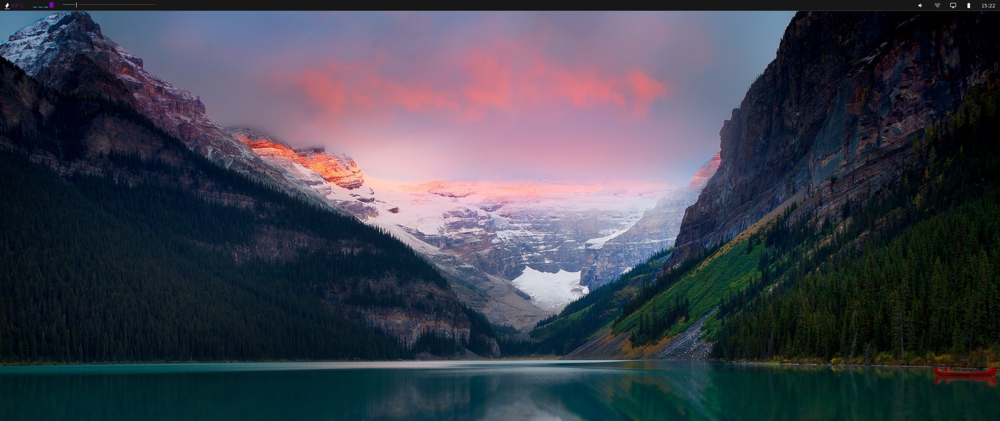
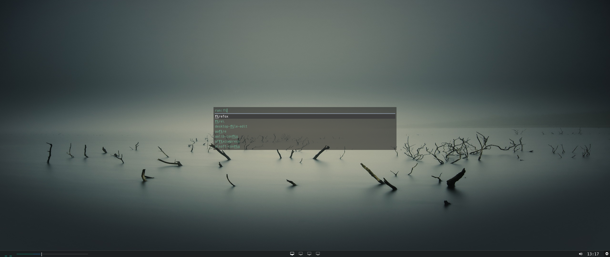
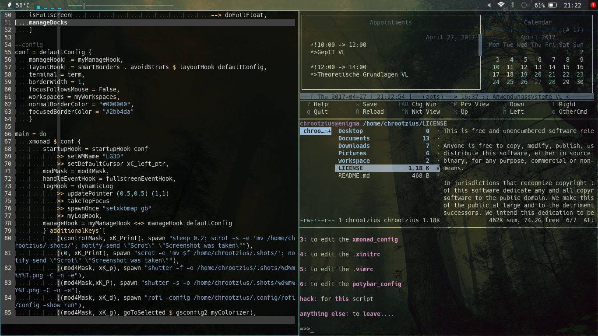

# dotfiles

> Dotfiles flying around

Clean desktop

Rofi run dialog

Fake buisy

## visible software

-	[i3wm](https://i3wm.org/)
-	[Vim](https://github.com/vim/vim)
-	[Rofi](https://github.com/DaveDavenport/rofi)
-	[Compton](https://github.com/chjj/compton)
-	[Ranger](https://github.com/ranger/ranger)
-	[Polybar](https://github.com/jaagr/polybar)
