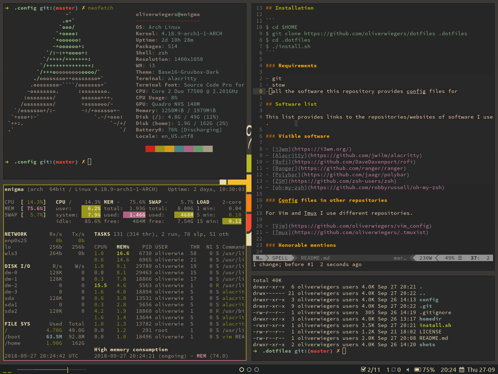
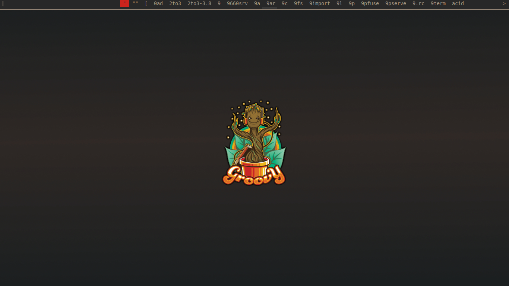

# Dotfiles

> Dotfiles flying around

I use this repository to backup and restore my daily drivers and because I keep
forgetting things I keep all the information on my config in this README.

I use the configuration mostly on my Linux systems but partly on a mac for work.
The install script is os aware and will only create symlinks for macOS useable
software if executed on macOS.

Furthermore the script will ask wether to install configuration files for Vim
and Tmux from other repositories listed down below or not.

## Look

These are screenshots from my current Void Linux system.

Neofetch.


Clean desktop.


Dmenu using
[menu_launcher](https://github.com/oliverwiegers/scripts/blob/master/menu_launcher.sh)
script.


## Requirements

- git
- stow
- all the software this repository provides config files for

## Installation

This script will clone this repo, [zsh-syntax-highlighting](https://github.com/zsh-users/zsh-syntax-highlighting), [zsh-autosuggestions](https://github.com/zsh-users/zsh-autosuggestions), [oh-my-zsh](https://github.com/robbyrussell/oh-my-zsh) and will ask to clone my [Vim config](https://github.com/oliverwiegers/vim_config), my [Tmux config](https://github.com/oliverwiegers/.tmuxist) and my personal [scripts](https://github.com/oliverwiegers/scripts).
The [install.sh](install.sh) won't install any packages, only config files.

### Interactive installation

```bash
$ curl -fsSL https://raw.githubusercontent.com/oliverwiegers/dotfiles/master/install.sh -o install.sh && chmod +x install.sh && ./install.sh
```

### Non-interactive installation

The `NON_INTERACTIVE` env variable can be set to clone all repositories and
components without asking. Be careful, you might loose your own config files.

```bash
$ curl -fsSL https://raw.githubusercontent.com/oliverwiegers/dotfiles/master/install.sh -o install.sh && chmod +x install.sh && NON_INTERACTIVE=true ./install.sh
```

## Development and Testing

This script of course can be tested inside a docker container. The repository
provides a Dockerfile to build an Ubuntu image including all needed packages to
run my shell configuration. Some of the installed packages aren't needed to test
the script itself but the functionality of the configuration afterwards.

In addition to the `NON_INTERACTIVE` env variable the install script and the
Dockerfile both know the `GIT_BRANCH` env variable to curl the install script
from the right branch and checkout the right branch after cloning. The default
is the master branch.

### Testing remote changes

```bash
$ git clone git@github.com:oliverwiegers/dotfiles.git
$ cd dotfiles
$ export branch="$(git rev-parse --abbrev-ref HEAD)"
$ docker build -t install_test:"${branch}" --build-arg GIT_BRANCH="${branch}" .
$ docker container run -it install_test:"${branch}"
$ NON_INTERACTIVE=true ./install.sh
$ zsh
```

### Testing local changes

```bash
$ git clone git@github.com:oliverwiegers/dotfiles.git
$ cd dotfiles
$ export branch="$(git rev-parse --abbrev-ref HEAD)"
$ docker build -t install_test:"${branch}" --build-arg GIT_BRANCH="${branch}" .
$ docker container run -v $PWD:/root/.dotfiles -it install_test:"${branch}"
$ cd .dotfiles
$ NON_INTERACTIVE=true ./install.sh
$ zsh
```

## Software list

This list provides links to the repositories/websites of software I use.

### Visible software

- [bspwm](https://github.com/baskerville/bspwm)
- [alacritty](https://github.com/alacritty/alacritty)
- [dmenu](https://tools.suckless.org/dmenu/)
- [Ranger](https://github.com/ranger/ranger)
- [Polybar](https://github.com/jaagr/polybar)
- [ZSH](https://github.com/zsh-users/zsh)
- [oh-my-zsh](https://github.com/robbyrussell/oh-my-zsh)

### Config files in other repositories

For Vim and Tmux I use different repositories.

- [Vim](https://github.com/oliverwiegers/vim_config)
- [Tmux](https://github.com/oliverwiegers/.tmuxist)

### Honorable mentions

This repository contains also my config files for the following software not 
seen in the screenshots.

- [Dunst](https://github.com/dunst-project/dunst.git)
- [Zathura](https://git.pwmt.org/pwmt/zathura)
- [gpicview](https://github.com/onlyshk/GPicView)
- [Ranger](https://github.com/ranger/ranger)
- [bat](https://github.com/sharkdp/bat)

### Software I also use

- [Glances](https://github.com/nicolargo/glances)
- [htop](https://github.com/hishamhm/htop)

A big shoutout to [dylanaraps](https://github.com/dylanaraps/) for 
[pywal](https://github.com/dylanaraps/pywal). This is an awesome tool. It took 
me some time to reconfigure my system to use the full potential, but it is worth
it a thousand times.
