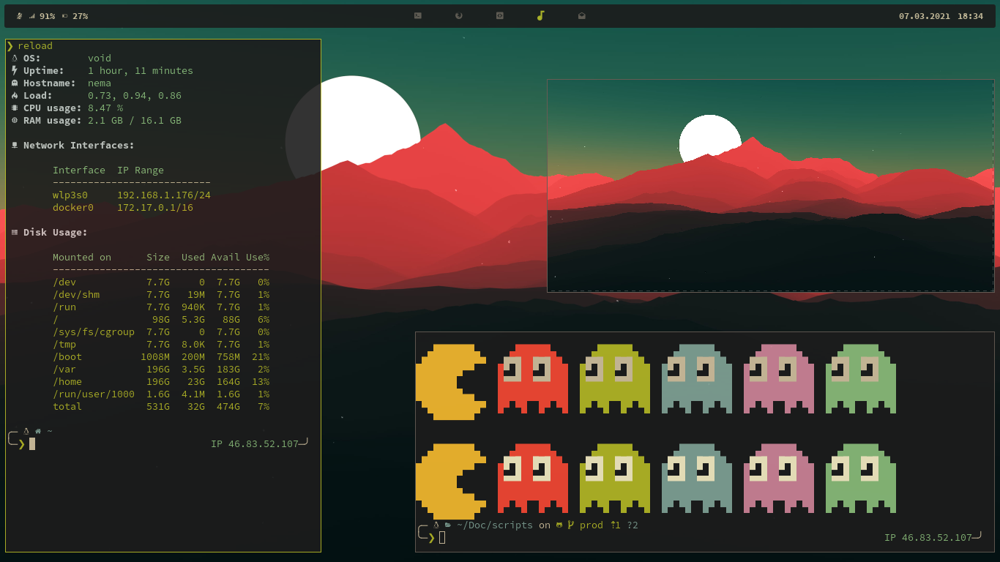
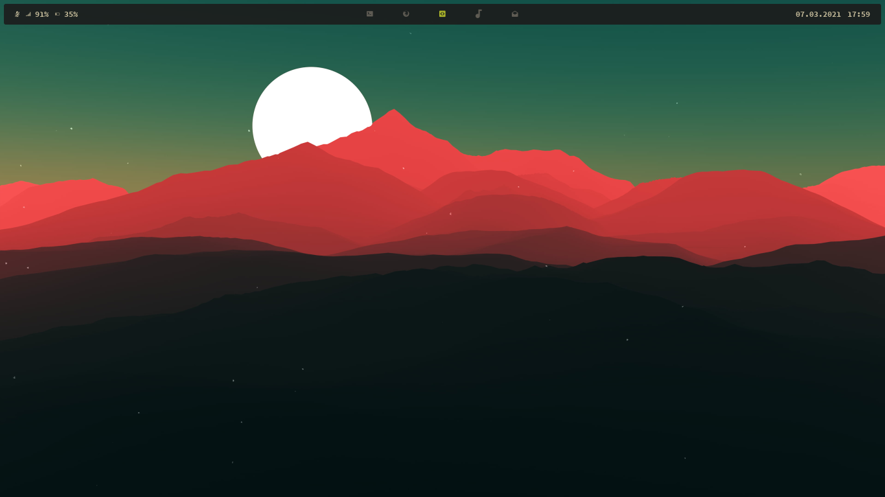
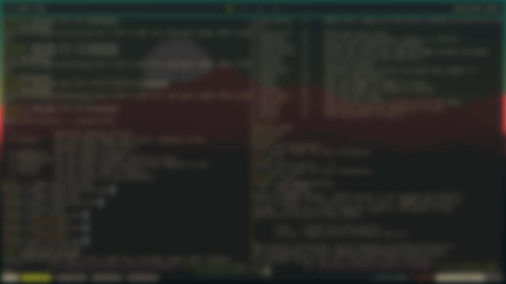
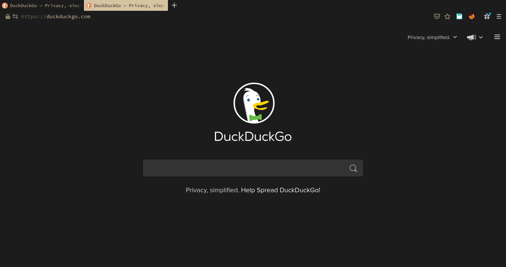
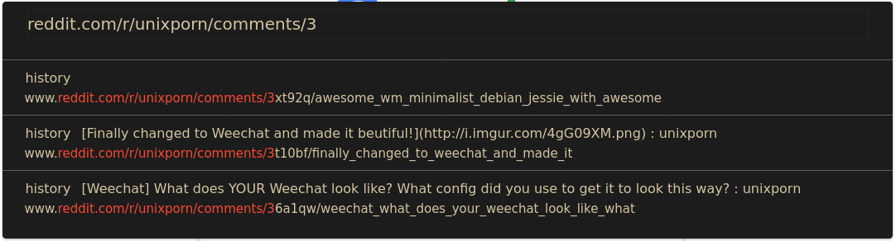
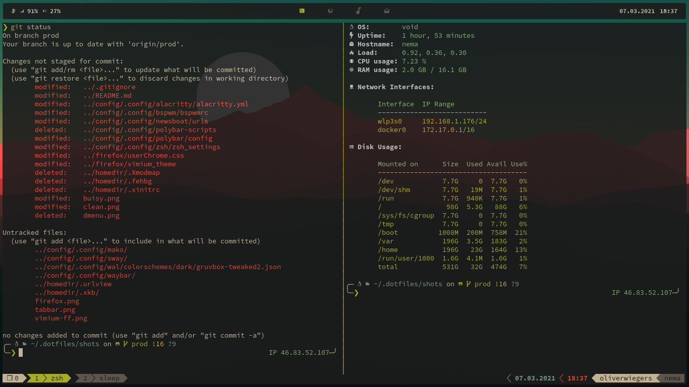

<p align="center">
  
</p>

<p align="center">
  <b>There's no place like ~/</b>
</p>

<hr>

### Nice to have you!




These are the dotfiles for my current setup.

This configuration aims to be simple and portable. Yet there are some parts
that wont work on MacOS.

The [Installation section](#installation) will guide you through the
installation process.

For some visuals refer to the [Gallery section](#gallery).

Main software:

- **WM**: [Sway](https://github.com/swaywm/sway)
- **OS**: [Void Linux](https://voidlinux.org/)
- **Shell**: [ZSH](https://github.com/zsh-users/zsh)
- **Terminal**: [Alacritty](https://github.com/alacritty/alacritty)
- **Editor**: [Vim](https://github.com/neovim/neovim/)
- **Launcher**: [Wofi](https://hg.sr.ht/~scoopta/wofi)
- **Browser**: Firefox -> See [Firefox section](#firefox)
- **Theme**: [Gruvbox](https://github.com/morhetz/gruvbox)
- **Wallpaper**: [Wallpaper
  Flare](https://www.wallpaperflare.com/red-mountains-and-moon-digital-wallpaper-red-mountain-illustration-wallpaper-pu)

## Installation

I use the configuration mostly on my Linux systems but partly on a mac for work.
The install script is OS aware and will only create symlinks for macOS useable
software if executed on macOS.

Furthermore the script will ask wether or not to install configuration files for
Vim and Tmux from other repositories listed down below.

The [install.sh](install.sh) wont install any packages, only config files.

The install script will clone the following repos:

- This repo.
- [powerlevel10k](https://github.com/romkatv/powerlevel10k)
- [zsh-syntax-highlighting](https://github.com/zsh-users/zsh-syntax-highlighting)
- [zsh-autosuggestions](https://github.com/zsh-users/zsh-autosuggestions)
- [oh-my-zsh](https://github.com/robbyrussell/oh-my-zsh)
- [gruvbox-gtk](https://github.com/3ximus/gruvbox-gtk.git)
- [ranger-devicons](https://github.com/alexanderjeurissen/ranger_devicons)

The install script will ask to clone / setup the following repos:

- [Vim config](https://github.com/oliverwiegers/vim_config)
- [Tmux config](https://github.com/oliverwiegers/.tmuxist)
- [scripts](https://github.com/oliverwiegers/scripts)

Furthermore the
[SourceCodePro Nerd Font](1) will be installed.

### Requirements

- git
- stow
- wget

### Installation

Clone all repositories and components without asking. Be careful, you might
loose your own config files.

```bash
curl \
    -fsSL \
    https://raw.githubusercontent.com/oliverwiegers/dotfiles/prod/install.sh \
    -o install.sh \
    && chmod +x install.sh \
    && ./install.sh
```

If there are current configuration files these will be moved to
`$HOME/current_config_backup-$(date +%Y%m%d%H%m)"` so the install script should
not delete or override any files.

## Development and Testing

This script can be tested inside a docker container. The repository provides a
Dockerfile to build an Ubuntu image including all needed packages to run my
shell configuration. Some of the installed packages aren't needed to test
the script itself but the functionality of the configuration afterwards.

The install script and the Dockerfile both know the `GIT_BRANCH` env variable to
curl the install script from the right branch and checkout the right branch
after cloning. The default is the prod branch.

### Testing remote changes

```bash
git clone git@github.com:oliverwiegers/dotfiles.git
cd dotfiles
export branch="$(git rev-parse --abbrev-ref HEAD)"
docker build -t install_test:"${branch}" --build-arg GIT_BRANCH="${branch}" .
docker container run -it install_test:"${branch}"
./install.sh
zsh
```

### Testing local changes

```bash
git clone git@github.com:oliverwiegers/dotfiles.git
cd dotfiles
export branch="$(git rev-parse --abbrev-ref HEAD)"
docker build -t install_test:"${branch}" --build-arg GIT_BRANCH="${branch}" .
docker container run -v $PWD:/root/.dotfiles -it install_test:"${branch}"
cd .dotfiles
./install.sh
zsh
```

## Software

The install script intalls configuration files for the following software.

### Included in this repo

- [Sway](https://github.com/swaywm/sway)
- [Wofi](https://hg.sr.ht/~scoopta/wofi)
- Firefox -> See [Firefox section](#firefox)
- [Alacritty](https://github.com/alacritty/alacritty)
- [Ranger](https://github.com/ranger/ranger)
- [ZSH](https://github.com/zsh-users/zsh)
- [Oh-my-zsh](https://github.com/robbyrussell/oh-my-zsh)
- [Powerlevel10k](https://github.com/romkatv/powerlevel10k)
- [Zathura](https://git.pwmt.org/pwmt/zathura)
- [Ranger](https://github.com/ranger/ranger)
- [Bat](https://github.com/sharkdp/bat)
- [Urlview](https://github.com/sigpipe/urlview)
- [Mako](https://github.com/emersion/mako)
- [Pywal](https://github.com/dylanaraps/pywal)

### Cloned from other repos

For Vim and Tmux I use different repositories.

- [Vim](https://github.com/oliverwiegers/vim_config)
- [Tmux](https://github.com/oliverwiegers/.tmuxist)

A big shoutout to [dylanaraps](https://github.com/dylanaraps/) for
[pywal](https://github.com/dylanaraps/pywal). This is an awesome tool. It took
me some time to reconfigure my system to use the full potential, but it is worth
it a thousand times.

### Firefox

Firefox is highly customized using `userChrome.css` and
[Vimium](https://addons.mozilla.org/en-US/firefox/addon/vimium-ff/).

#### Show TabBar in fullscreen mode

- Open about:config.
- Set `browser.fullscreen.autohide` to `false`.

#### userChrome.css

The [userChrome.css](extra/firefox/userchrome.css) uses the colors created bu
pywal. These are stored in `~/.cache/wal/colors.css` by default. To enable this
do the following:

- Open about:config.
- Set `toolkit.legacyUserProfileCustomizations.stylesheets` to `true`.
- Enable userChrome.css support. (FF 69+).
- Open about:profile.
- Find out currently used profile.
- Create `$HOME/.mozilla/firefox/$profile_name/chrome` directory.
- Create `$HOME/.mozilla/firefox/$profile_name/chrome/userChrome.css` file.
- Add some rules.
- Restart Firefox.

#### Vimium-FF

To apply the Vimium config you need to apply the config in the plugin settings
inside of Firefox. I didn't find a way to import the pywal colors so you need to
generate the final config by hand.

- Generate config.
    - `cat ~/.cache/wal/colors.css ~/.dotfiles/extra/firefox/vimium_theme | clipcopy`
- Open Firefox.
- Type `about:addons` into URL bar and hit Enter.
- Go to Vimium preferences.
- Open "Advanced Options".
- Clear "CSS for Vimium UI".
- Paste the genereted config into the empty text field.
- Save changes.

## Gallery

These are screenshots from my current Void Linux system.

### Fake Buisy


### Clean Desktop


### Locked Screen



### Firefox Clean



### Firefox Tabbar


### Firefox Vimium-FF



### Tmux



## ToDo

- Create Keybing Section
- Create theming mechanism / script
    - Copy wallpaper to ~/.cache/wallpaper.png
    - Talk to pywal
    - Set GTK theme
    - generate vimium theme
    - Themes
        - Gruvbox
        - Nord
        - Dracula
        - Onehalf
        - Spaceduck
        - Iceberg

[1](https://github.com/ryanoasis/nerd-fonts/tree/master/patched-fonts/SourceCodePro)
