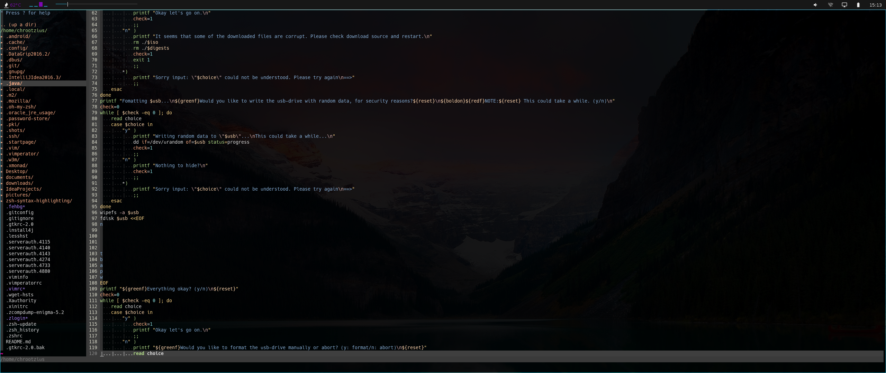

# dotfiles

> Dotfiles flying around

## visible software

-   [Xmonad](https://github.com/xmonad/xmonad)
-   [Vim](https://github.com/vim/vim)
-   [Rofi](https://github.com/DaveDavenport/rofi)
-   [Compton](https://github.com/chjj/compton)
-   [Ranger](https://github.com/ranger/ranger)
-   [Polybar](https://github.com/jaagr/polybar)
